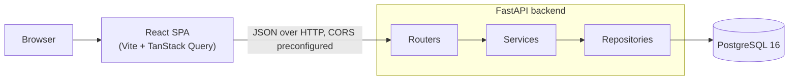

# Architecture

A browser-rendered React SPA talks over plain JSON HTTP to a FastAPI backend that owns all domain
logic, which talks to PostgreSQL. There is no SSR tier: the API backend is the only server, and
the database is the only state.

**Layers** (`backend/app/`): **routers** own HTTP only — request/response shape, status codes,
`If-Match` parsing; **services** own domain rules — cycle detection, the blocking rule, recurrence
date math, status transitions; **repositories** own queries, pagination, and the soft-delete
filter; Pydantic schemas sit at the boundary so SQLAlchemy models never leak out of a route. The
split exists for testability: the three non-trivial behaviours (cycles, blocking, recurrence math)
are pure functions over plain data, testable without HTTP or a database, while the integration
suite exercises the real API against real Postgres.

## The request path for a status change

`POST /api/todos/{id}/status` is the one operation that touches every layer, so it is worth
walking end to end. The **router** parses the required `If-Match` header and the payload, then
delegates to the service. The **service** loads the todo, checks the version (a stale caller gets
`409` with the current state), validates the transition against the state machine, and folds the
dependency guard into the CAS itself: `UPDATE todos SET status = ..., version = version + 1 WHERE
id = ? AND version = ? AND unmet_dependency_count = 0` (the count predicate applies only to the
dependency-protected targets). If the update commits, a completion on a recurring todo spawns the
next occurrence, and the dependents' counts are recomputed in the same transaction. The **router**
returns `{ todo, next_occurrence }` with the new `ETag`. Every failure — `409` conflict,
`422 BLOCKED_BY_DEPENDENCIES` (listing the blockers), `428` missing precondition — is raised by
the service as a domain exception and serialized to RFC 9457 Problem Details by a single exception
handler, so the client always receives the same error shape.
