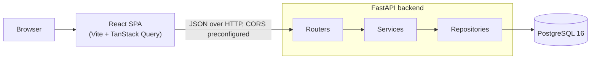
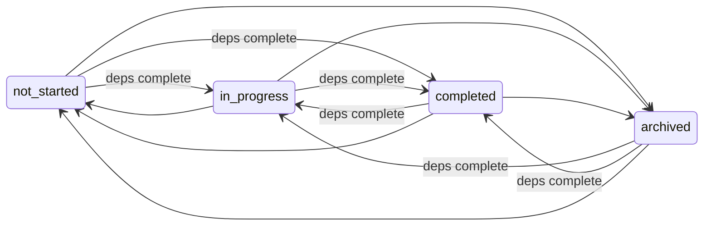

# Architecture

A browser-rendered React SPA talks over plain JSON HTTP to a FastAPI backend that owns all domain
logic, which talks to PostgreSQL. There is no SSR tier: the API backend is the only server, and
the database is the only state.

The layer diagram below is the shape of many applications; the two diagrams after it are the parts
specific to this one — how a write conflict is decided, and which status changes the dependency
rule guards.



**Layers** (`backend/app/`): **routers** own HTTP only — request/response shape, status codes,
`If-Match` parsing; **services** own domain rules — cycle detection, the blocking rule, recurrence
date math, status transitions; **repositories** own queries, pagination, and the soft-delete
filter; Pydantic schemas sit at the boundary so SQLAlchemy models never leak out of a route. The
split exists for testability: the three non-trivial behaviours (cycles, blocking, recurrence math)
are pure functions over plain data, testable without HTTP or a database, while the integration
suite exercises the real API against real Postgres.

## The request path for a status change

`POST /api/todos/{id}/status` is the one operation that touches every layer, so it is worth
walking end to end. The **router** parses the required `If-Match` header and the payload, then
delegates to the service. The **service** loads the todo, checks the version (a stale caller gets
`409` with the current state), validates the transition against the state machine, and folds the
dependency guard into the CAS itself: `UPDATE todos SET status = ..., version = version + 1 WHERE
id = ? AND version = ? AND unmet_dependency_count = 0` (the count predicate applies only to the
dependency-protected targets). If the update commits, a completion on a recurring todo spawns the
next occurrence, and the dependents' counts are recomputed in the same transaction. The **router**
returns `{ todo, next_occurrence }` with the new `ETag`. Every failure — `409` conflict,
`422 BLOCKED_BY_DEPENDENCIES` (listing the blockers), `428` missing precondition — is raised by
the service as a domain exception and serialized to RFC 9457 Problem Details by a single exception
handler, so the client always receives the same error shape.

## How a write conflict is decided

Two people editing the same todo is the normal case on a shared board, so it is worth showing
exactly where the loser is determined.

```mermaid
sequenceDiagram
    autonumber
    participant A as Tab A
    participant B as Tab B
    participant API as FastAPI
    participant DB as PostgreSQL

    Note over A,B: both loaded the todo at version 2

    A->>API: PATCH /api/todos/:id — If-Match "2"
    API->>DB: UPDATE … SET version = 3 WHERE id = ? AND version = 2
    DB-->>API: 1 row updated
    API-->>A: 200 — ETag "3"

    B->>API: PATCH /api/todos/:id — If-Match "2"
    API->>DB: UPDATE … SET version = 3 WHERE id = ? AND version = 2
    DB-->>API: 0 rows updated
    API->>DB: SELECT the current row, resolve its author
    API-->>B: 409 VERSION_CONFLICT — current state + who changed it
    Note over B: banner names the actor; Reload refetches at version 3
```

Steps 6 and 7 are the whole idea: **there is no read-then-write gap.** The version is not checked
in application code and then written — the check is a predicate inside the single `UPDATE`, so the
database decides the winner, and the loser learns it from an affected-row count of zero. Two
concurrent writers cannot both succeed, however their requests interleave.

The `SELECT` that follows only exists to build a useful error: it recovers the current version and
the username to put in the banner, so the client can recover without guessing. Failing that lookup
would not change who won.

## Status transitions and the dependency guard

The machine is deliberately permissive: reopening a completed todo and unarchiving are both
allowed, and the only transition rejected outright is one to the status a todo already has. The
dependency rule is the sole real constraint.



Every edge entering `in_progress` or `completed` carries the guard; every other edge is free.

Two decisions are visible here. **`archived` is not guarded** — parking a blocked task is always
legitimate, and refusing it would trap work behind a dependency the user has chosen to defer.
And the guard covers `→ completed`, not just `→ in_progress` as the brief specifies: without it a
caller could jump a blocked task straight to completed and bypass the feature entirely.

The guard is enforced twice, on purpose. `validate_transition` checks it first to produce a helpful
message naming the blockers, and `AND unmet_dependency_count = 0` is folded into the same `UPDATE`
shown above. The pre-check is for the human; the predicate is what makes the rule true, because
`unmet_dependency_count` can change between the two.
